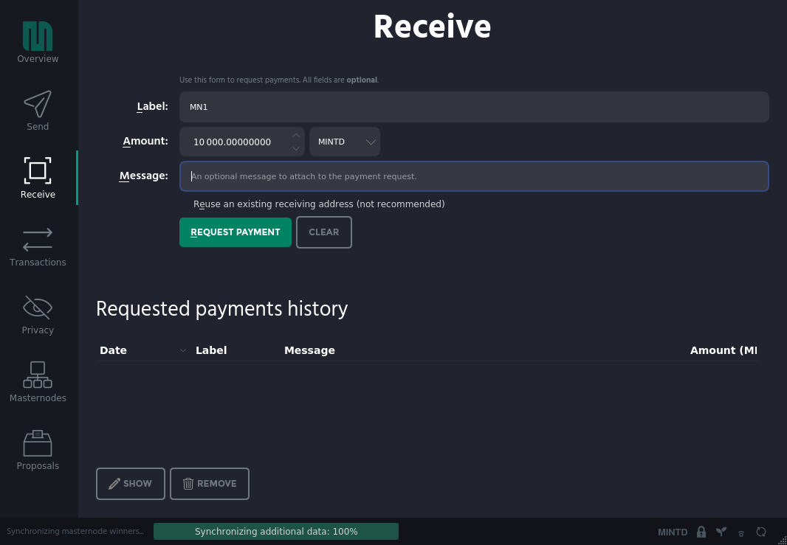
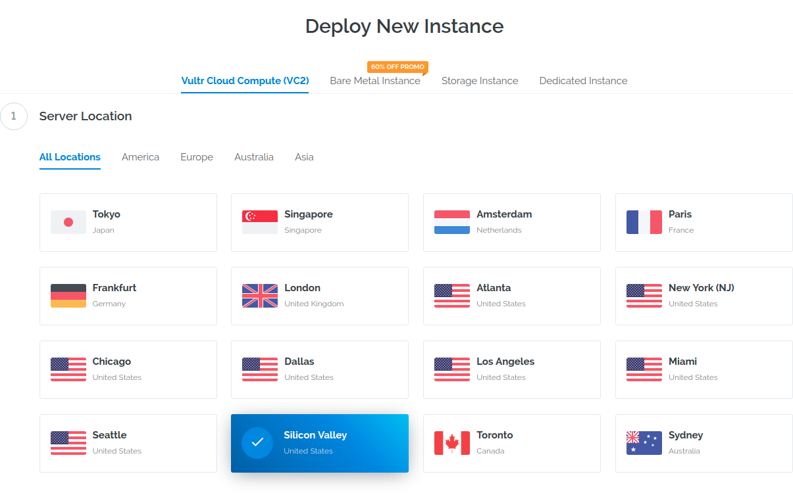
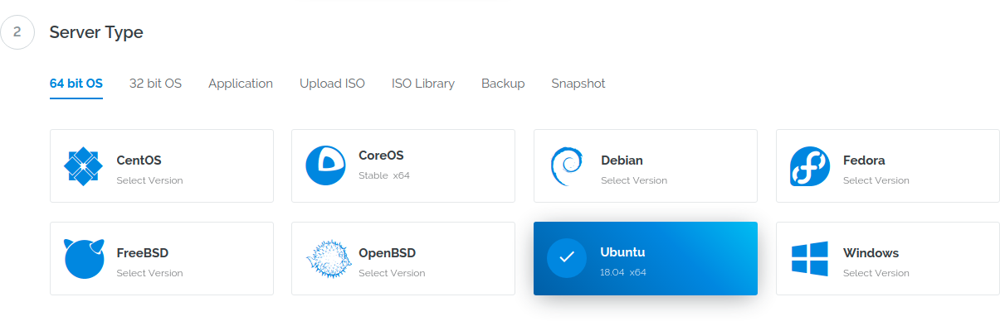
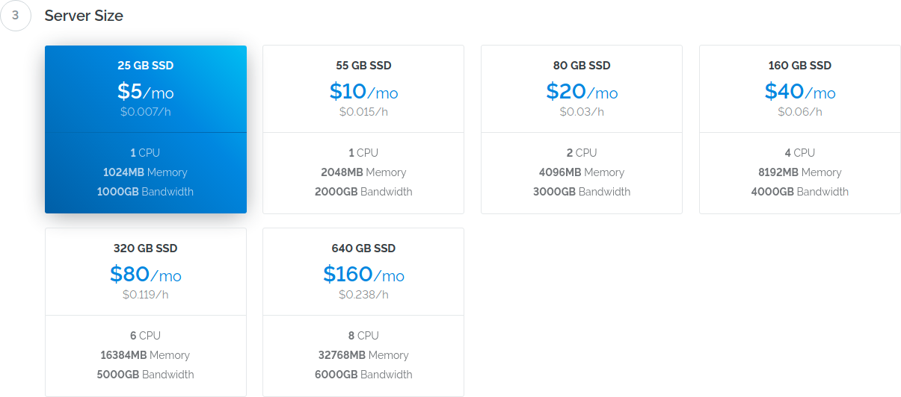
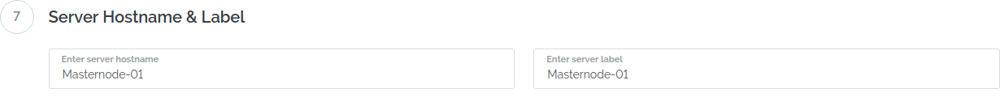
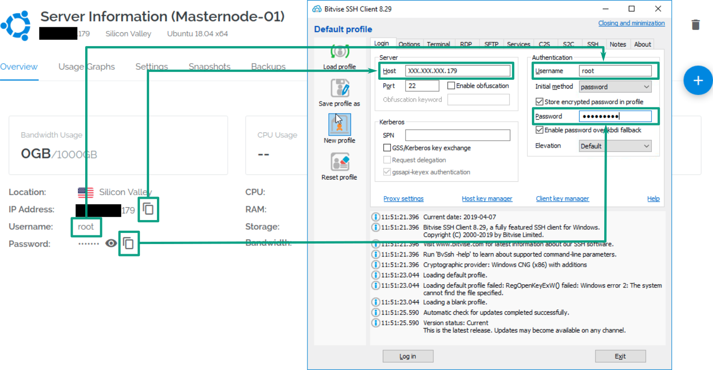
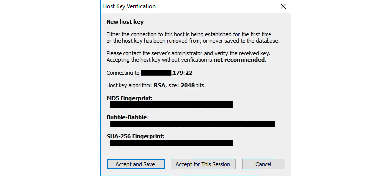
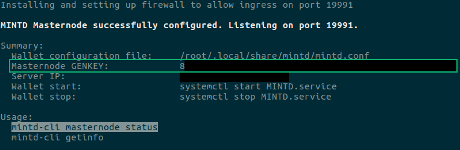
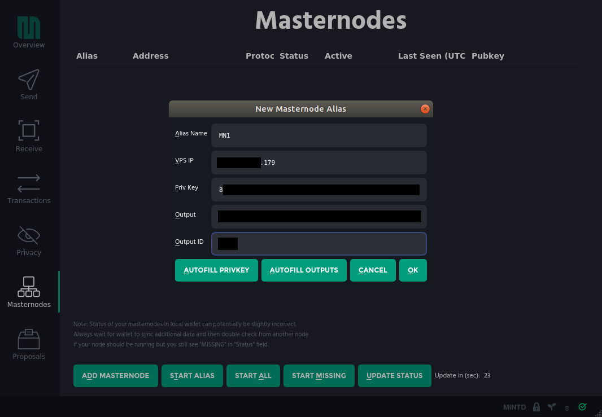

Masternode Setup Guide
======================

This document is a guide to set up a MINTD Masternode in a Microsoft
Windows, macOS, or GNU/Linux platform.

Prerequisites:

-   10,000 MINTD as Masternode collateral
-   Latest wallet client for your platform
-   A main computer (your everyday computer). This will run the control
    wallet, hold your collateral and can be turned on/off without
    affecting the Masternode
-   Masternode Server (VPS---The computer that will be on 24/7)
-   A unique IP address for your VPS/Remote wallet

Configure Control Wallet
------------------------

1.  Open the wallet client and move to "Receive" tab
2.  Enter a label without spaces (e.g. `MN1`) and mark the amount as
    10,000 MINTD

    

3.  Click "Request payment"
4.  Copy the receive address from the dialog box that immediately
    follows
5.  Move to "Send" tab
6.  Enter the copied address from above and send **exactly** 10,000
    MINTD in a single transaction
7.  Wait for this transaction to get confirmed in the blockchain
8.  Edit **Wallet Configuration File** (**Tools** -&gt; **Open Wallet
    Configuration File**) with the following:

    ``` {.conf}
    rpcuser=[username]
    rpcpassword=[password]
    rpcallowip=127.0.0.1
    listen=0
    server=1
    daemon=1
    logtimestamps=1
    maxconnections=256
    ```

    Note that `[username]` and `[password]` should be replaced
    accordingly with secure credentials ([The Simplest Security: A Guide
    To Better Password
    Practices](https://www.symantec.com/connect/articles/simplest-security-guide-better-password-practices)).

Configure Remote Wallet
-----------------------

1.  Create an Account at [Vultr](https://www.vultr.com/?ref=8005807)
2.  After you have added funds to your account, go
    [here](https://my.vultr.com/deploy/) to create your server
3.  Choose a server location (preferably somewhere close to you)

    

4.  Choose the server type as Ubuntu 18.04

    

5.  Choose a server size. It's sufficient to opt for \$5/mo

    

6.  Set a server hostname and label (e.g. `Masternode-01`)

    

7.  Click "Deploy Now"
8.  Wait for the server to spin up
9.  Connect to the server with [Bitvise SSH
    Client](https://www.bitvise.com/ssh-client-download) using the
    credentials listed under the server details page

    

    

10. Use our installation script to set up your masternode in one go:

    ``` {.bash}
    curl -sL https://raw.githubusercontent.com/mintdcoin/MINTD-Documentation/master/masternode-guide/install.sh | bash -
    ```

    (Note that this command [gets the installation script from our
    GitHub
    repository](https://raw.githubusercontent.com/mintdcoin/MINTD-Documentation/master/masternode-guide/install.sh).
    We recommend that you review the code to your liking)
11. Sit back and wait for the installation to complete (this will take a
    few minutes)
12. When finished, make a copy of the output, in particular, the
    **Masternode GENKEY**.

    

Start Masternode
----------------

1.  From your control wallet, move to the "Masternodes" tab and click
    "Add Masternode"
2.  Update the form with the Alias Name (e.g. `MN1`), VPS IP address,
    Priv Key (Masternode GENKEY from before), click "Autofill Outputs"
    and press "OK"

    

3.  Click "Start Missing" (or select the Masternode and click "Start
    Alias")
4.  From you VPS, confirm the status of your Masternode with the
    following:

    ``` {.bash}
    mintd-cli masternode status
    ```

5.  If you see status 4 or 9 then congratulations! You have now
    successfully activated a Masternode
6.  If not, please contact support at
    <https://discordapp.com/invite/Q8tsgCw> for further assistance

